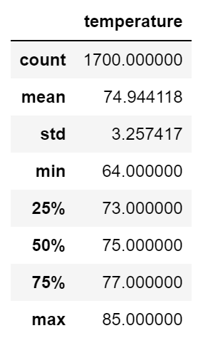
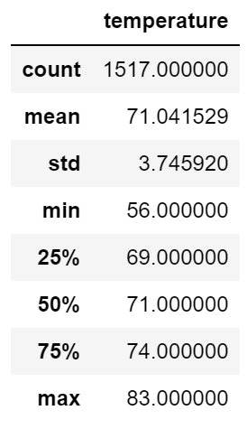

# surfs_up

## Overview of the analysis: 
W. Avy wants more information about temperature trends before opening the surf shop. Specifically, he wants the temperature data for the months of June and December in Oahu, in order to determine if the surf and ice cream shop business is sustainable year-round.

## Results: Provide a bulleted list with three major points from the two analysis deliverables. Use images as support where needed.

- June temperature has a mean of 74.9 

- December's temperature has a mean of 71.0 degrees making it not too cold. 

- Both months max temperatures are over 80 degrees.

## Summary: Provide a high-level summary of the results and two additional queries that you would perform to gather more weather data for June and December.
Based on the results given for June and December, I would say temperature would not normally be a hinderance to sales for the surf shop. I would run more queries for maybe November and January based on the winter seasons to see if there would be a drop in temperature as it would be too cold to open the shop. 
